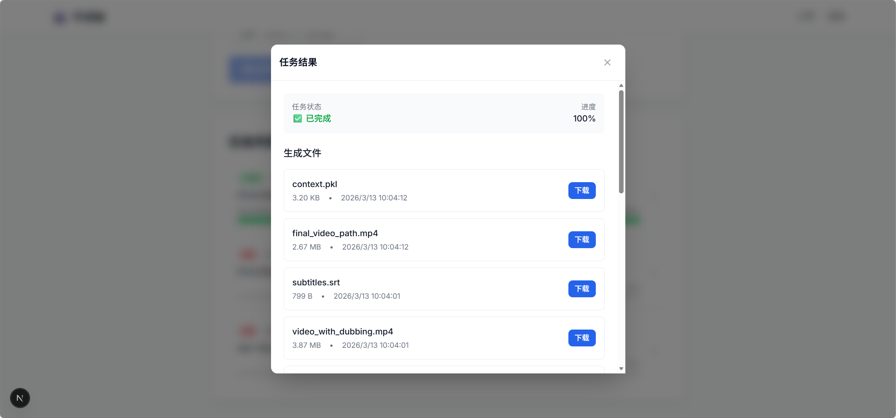

[English](README.en-US.md) | [中文](README.md)

## What This App Does

Video Dubbing API is an asynchronous service for turning source video or audio into translated dubbing outputs. It packages the full workflow behind HTTP APIs, including transcription, translation, subtitle generation, text-to-speech, vocal separation, audio replacement, and final media export.

Typical use cases:

- Submit a video or audio file for automatic dubbing.
- Track long-running processing progress by `task_id`.
- Download generated subtitles and output media files after the pipeline completes.

## Screenshots




TIPS: UI project is [→Here←](https://github.com/NicolasFive/Video_Add_Dubbing_UI)

# Quick Start

## 1. Prerequisites

- Python `3.12.3+`
- Redis `6+` (or Docker)
- FFmpeg available in `PATH`
- A virtual environment is recommended

## 2. Environment Variables

Create a `.env` file in the project root. The table below describes each configuration item.

| Key | Required | Type | Example | Description |
| --- | --- | --- | --- | --- |
| `APP_NAME` | No | string | `Video Dubbing API` | Application display name. |
| `DEBUG` | No | boolean | `False` | Enables debug mode when set to `True`. |
| `LOG_LEVEL` | No | string | `INFO` | Logging level (for example `DEBUG`, `INFO`, `WARNING`, `ERROR`). |
| `SERVER_HOST` | No | string | `0.0.0.0` | API bind host. |
| `SERVER_PORT` | No | integer | `8000` | API bind port. |
| `STORAGE_ROOT` | No | string | `./storage` | Root directory for persistent and temp files. |
| `UPLOAD_DIR` | No | string | `uploads` | Subdirectory for uploaded source videos. |
| `TEMP_DIR` | No | string | `temp` | Subdirectory for intermediate processing files. |
| `RESULT_DIR` | No | string | `results` | Subdirectory for final outputs. |
| `ASSEMBLYAI_KEY` | Yes | string | `your_assemblyai_key` | API key for AssemblyAI transcription service. |
| `OPENAI_API_KEY` | Yes | string | `your_openai_api_key` | API key for OpenAI-compatible translation/reduction service. |
| `OPENAI_BASE_URL` | No | string(URL) | `https://api.openai.com/v1` | Base URL for OpenAI-compatible API endpoint. |
| `VOLCANO_TTS_APPID` | Yes | string | `your_volcano_app_id` | Doubao TTS 1.0 app ID. |
| `VOLCANO_TTS_ACCESS_TOKEN` | Yes | string | `your_volcano_access_token` | Doubao TTS 1.0 access token. |
| `REDIS_URL` | Yes | string(URL) | `redis://127.0.0.1:6379/0` | Redis connection URL used for task status storage. |
| `CELERY_BROKER_URL` | Yes | string(URL) | `redis://127.0.0.1:6379/0` | Celery broker/backend URL. |
| `FFMPEG_BIN` | No | string | `ffmpeg` | FFmpeg executable name or absolute path. |
| `DEMUCS_MODEL` | No | string | `htdemucs` | Demucs model identifier for vocal separation. | 3

Example `.env`:

```env
APP_NAME=Video Dubbing API
DEBUG=False
LOG_LEVEL=INFO
SERVER_HOST=0.0.0.0
SERVER_PORT=8000

STORAGE_ROOT=./storage
UPLOAD_DIR=uploads
TEMP_DIR=temp
RESULT_DIR=results

ASSEMBLYAI_KEY=your_assemblyai_key
OPENAI_API_KEY=your_openai_api_key
OPENAI_BASE_URL=https://api.openai.com/v1

VOLCANO_TTS_APPID=your_volcano_app_id
VOLCANO_TTS_ACCESS_TOKEN=your_volcano_access_token

REDIS_URL=redis://127.0.0.1:6379/0
CELERY_BROKER_URL=redis://127.0.0.1:6379/0

FFMPEG_BIN=ffmpeg
DEMUCS_MODEL=htdemucs
```

## 3. Quick Start Method A: Local Commands

### 3.1 Install Dependencies

```bash
python -m venv venv
# Linux/macOS: source venv/bin/activate
# Windows PowerShell: .\venv\Scripts\Activate.ps1
pip install -e .
```

### 3.2 Start API

```bash
python ./app/main.py
```

### 3.3 Start Celery Worker (new terminal)

Linux/macOS:

```bash
celery -A app.tasks.backend worker -l info
```

Windows (recommended):

```powershell
celery -A app.tasks.backend worker -l info --pool=solo
```

Note: Ensure Redis is already running and reachable by `REDIS_URL`/`CELERY_BROKER_URL`.

## 4. Quick Start Method B: Docker

```bash
docker compose up --build
```

Access URLs:

- Swagger UI: `http://127.0.0.1:8000/docs`
- Health Check: `http://127.0.0.1:8000/v1/health`

Notes:

- Current `docker-compose.yml` starts `api` and `redis`.
- Inside the `api` container, `scripts/start.sh` starts both API and Celery worker.

## 5. HTTP API Details

Base URL (local default): `http://127.0.0.1:8000`

### 5.1 `POST /v1/dubbing`

Purpose: Submit an asynchronous dubbing task and return `task_id`.

Content-Type: `multipart/form-data`

#### Request Parameters

| Name | In | Type | Required | Description |
| --- | --- | --- | --- | --- |
| `video` | form-data | file | conditional | Uploaded source video file. |
| `audio` | form-data | file | conditional | Uploaded source audio file (audio-only dubbing flow). |
| `voice_type` | form-data | string | No | TTS speaker/voice type. |
| `task_id` | form-data | string | No | Task ID. Auto-generated if omitted. Can be reused for resume/retry workflows. |
| `start_step` | form-data | string | No | Start from a specific pipeline step (exact step name required). |
| `end_step` | form-data | string | No | Stop after a specific pipeline step. |

Validation rules:

- For a new task (when `task_id` is omitted), at least one of `video` or `audio` must be provided.
- When `task_id` is provided (resume/retry), API allows submitting without new upload files.

#### Success Response (`200`)

| Field | Type | Description |
| --- | --- | --- |
| `task_id` | string | Unique task ID. |
| `status` | string | Initial status, usually `pending`. |
| `message` | string | Result message. |
| `created_at` | string(datetime) | Task creation timestamp. |

Example request:

```bash
curl -X POST "http://127.0.0.1:8000/v1/dubbing" \
  -F "video=@./sample.mp4" \
  -F "voice_type=zh_female_meilinvyou" \
```

Example response:

```json
{
  "task_id": "xxxxxxxx-xxxx-xxxx-xxxx-xxxxxxxxxxxx",
  "status": "pending",
  "message": "Task submitted successfully",
  "created_at": "2026-03-06T10:00:00.000000"
}
```

### 5.2 `GET /v1/status/task_id/{task_id}`

Purpose: Query task status and progress.

#### Path Parameters

| Name | Type | Required | Description |
| --- | --- | --- | --- |
| `task_id` | string | Yes | Task ID. |

#### Success Response (`200`)

| Field | Type | Description |
| --- | --- | --- |
| `task_id` | string | Task ID. |
| `status` | string | `pending` / `processing` / `success` / `failed` / `unknown`. |
| `video_url` | string/null | Output video URL/path (may be empty in current implementation). |
| `subtitle_url` | string/null | Output subtitle URL/path (may be empty in current implementation). |
| `error_detail` | string/null | Error details (may be returned when failed). |
| `progress` | integer | Progress percentage in range `0-100`. |
| `current_step` | string/null | Current pipeline step name (defaults to `Unknown` if status detail is missing). |

Example request:

```bash
curl "http://127.0.0.1:8000/v1/status/task_id/<task_id>"
```

Example response:

```json
{
  "task_id": "xxxxxxxx-xxxx-xxxx-xxxx-xxxxxxxxxxxx",
  "status": "processing",
  "video_url": null,
  "subtitle_url": null,
  "error_detail": null,
  "progress": 40,
  "current_step": "Translating"
}
```

### 5.3 `GET /v1/result/task_id/{task_id}`

Purpose: List task-generated files and provide downloadable links.

#### Path Parameters

| Name | Type | Required | Description |
| --- | --- | --- | --- |
| `task_id` | string | Yes | Task ID. |

#### Success Response (`200`)

| Field | Type | Description |
| --- | --- | --- |
| `task_id` | string | Task ID. |
| `status` | string | `pending` / `processing` / `success` / `failed` / `unknown`. |
| `files` | array | Generated file list under `storage/temp/{task_id}`. |
| `files[].file_name` | string | File name. |
| `files[].relative_path` | string | Task-relative file path (POSIX style). |
| `files[].size_bytes` | integer | File size in bytes. |
| `files[].updated_at` | string(datetime) | Last modified time. |
| `files[].download_url` | string | Download endpoint for this file. |
| `progress` | integer | Progress percentage in range `0-100`. |
| `current_step` | string/null | Current pipeline step. |
| `error_detail` | string/null | Error details when failed. |

Example request:

```bash
curl "http://127.0.0.1:8000/v1/result/task_id/<task_id>"
```

Example response:

```json
{
  "task_id": "xxxxxxxx-xxxx-xxxx-xxxx-xxxxxxxxxxxx",
  "status": "success",
  "files": [
    {
      "file_name": "final_video_path.mp4",
      "relative_path": "final_video_path.mp4",
      "size_bytes": 27834567,
      "updated_at": "2026-03-13T11:32:10",
      "download_url": "/v1/result/task_id/xxxxxxxx-xxxx-xxxx-xxxx-xxxxxxxxxxxx/download?file=final_video_path.mp4"
    },
    {
      "file_name": "subtitles.srt",
      "relative_path": "subtitles.srt",
      "size_bytes": 9210,
      "updated_at": "2026-03-13T11:31:20",
      "download_url": "/v1/result/task_id/xxxxxxxx-xxxx-xxxx-xxxx-xxxxxxxxxxxx/download?file=subtitles.srt"
    }
  ],
  "progress": 100,
  "current_step": "Completed",
  "error_detail": null
}
```

### 5.4 `GET /v1/result/task_id/{task_id}/download`

Purpose: Download a generated file by task-relative path.

#### Query Parameters

| Name | Type | Required | Description |
| --- | --- | --- | --- |
| `file` | string | Yes | File relative path returned by `files[].relative_path`. |

#### Success Response (`200`)

- Binary stream response (with `Content-Disposition` download filename).

Example request:

```bash
curl -L "http://127.0.0.1:8000/v1/result/task_id/<task_id>/download?file=subtitles.srt" -o subtitles.srt
```

### 5.5 `GET /v1/health`

Purpose: Health check for API and dependency components.

#### Request Parameters

None.

#### Success Response (`200`)

| Field | Type | Description |
| --- | --- | --- |
| `status` | string | `healthy` / `degraded` / `unhealthy`. |
| `details.redis` | string | Redis status. |
| `details.ffmpeg` | string | FFmpeg status. |
| `details.demucs` | string | Demucs status. |
| `details.disk_usage_percent` | number | Disk usage percentage. |

Example request:

```bash
curl "http://127.0.0.1:8000/v1/health"
```

## 6. Common Problems

- `Failed to connect to Redis`: check `REDIS_URL` and Redis port.
- `ffmpeg missing`: install FFmpeg and verify `ffmpeg -version` works.
- Worker receives tasks but no progress updates: check Celery logs and broker settings in `.env`.
- Worker multiprocessing issues on Windows: use `--pool=solo`.
